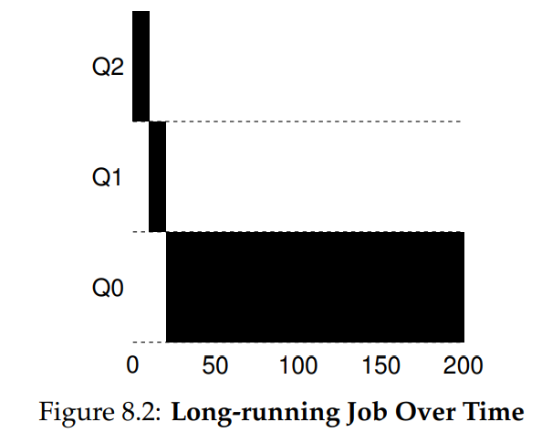
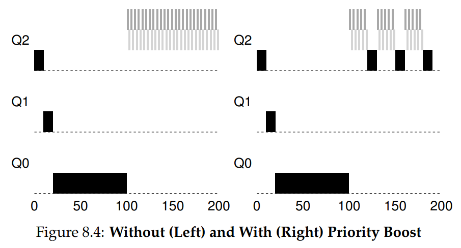
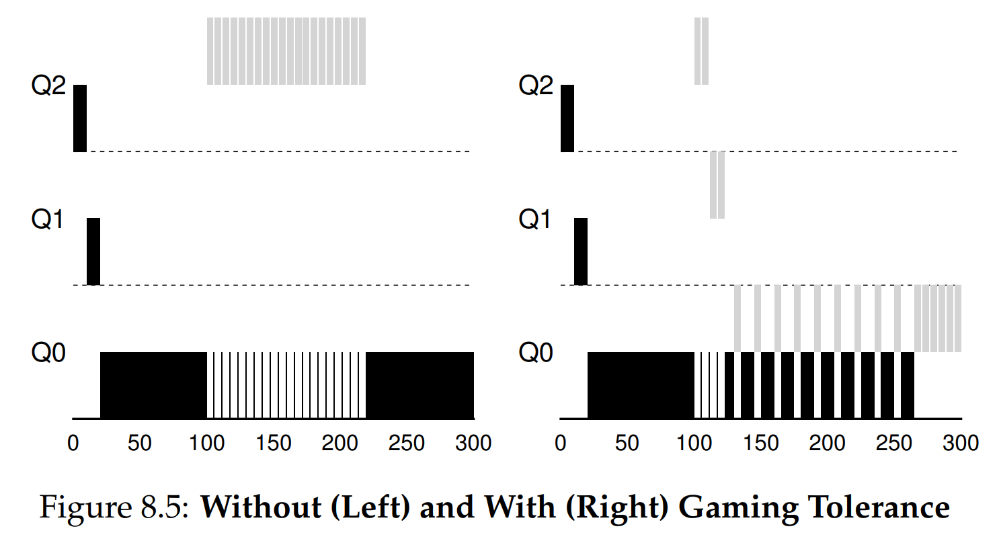

## 1. Run a few randomly-generated problems with just two jobs and two queues;<br>compute the MLFQ execution trace for each. <br>Make your life easier by limiting the length of each job and turning off I/Os.
```sh
./mlfq.py -j 2 -n 2 -m 5 -M 0 -s 1

Run JOB 0 at PRIORITY 1

Run JOB 1 at PRIORITY 1
Run JOB 1 at PRIORITY 1
Run JOB 1 at PRIORITY 1
Run JOB 1 at PRIORITY 1

./mlfq.py -j 2 -n 2 -m 5 -M 0 -s 2

Run JOB 0 at PRIORITY 1
Run JOB 0 at PRIORITY 1
Run JOB 0 at PRIORITY 1
Run JOB 0 at PRIORITY 1

Run JOB 1 at PRIORITY 1
```
## 2. How would you run the scheduler to reproduce each of the examples in the chapter? 


-n 3 -> 3 Queues<br>
-q 10 -> length of time slice<br>
-a 1 -> number of time slices to stay on a priority queue<br>
-l 0,200,0 -> start time, run time, I/O request<br>
-B 0 -> how often to boost the priority of all jobs back to high priority<br>

```sh
./mlfq.py -n 3 -q 10 -a 1 -l 0,200,0 -B 0 -c
```


```sh
./mlfq.py -n 3 -q 10 -a 1 -l 0,180,0:100,20,0 -B 0 -c
./mlfq.py -n 3 -q 10 -a 1 -i 9 -S -l 0,275,0:50,25,1 -c
```



```sh
./mlfq.py -n 3 -q 10 -a 1 -i 2 -S -l 0,100,0:100,50,2:100,50,2 -c
./mlfq.py -n 3 -q 10 -a 1 -i 2 -S -l 0,130,0:100,15,2:100,15,2 -B 30 -c
```



```sh
./mlfq.py -n 3 -q 10 -a 1 -i 1 -S -l 0,175,0:100,150,5 -c
./mlfq.py -n 3 -q 10 -a 1 -i 1 -l 0,175,0:100,95,5 -c
```


```sh
./mlfq.py -n 3 -Q 10,20,40 -a 2 -l 0,140,0:0,140,0 -c
```

## 3. How would you configure the scheduler parameters to behave just like a round-robin scheduler?

Set the number of queues to 1, because MLFQ uses RR for jobs on the same queue

no -I flag
```sh
./mlfq.py -n 1
```

## 4. Craft a workload with two jobs and scheduler parameters so that one job takes advantage of the older Rules 4a and 4b (turned on with the -S flag) to game the scheduler and obtain 99% of the CPU over a particular time interval.

```sh
./mlfq.py -n 3 -q 10 -a 1 -i 1 -S -l 0,200,0:50,90,9 -c
```

## 5. Given a system with a quantum length of 10 ms in its highest queue, how often would you have to boost jobs back to the highest priority level (with the -B flag) in order to guarantee that a single longrunning (and potentially-starving) job gets at least 5% of the CPU?

10 / x = 0.05 => x = 200ms

Job gets one quantum 10ms every 200ms => 5% cpu time

example:
```sh
./mlfq.py ./mlfq.py -n 3 -q 10 -a 1 -i 2 -S -l 0,200,0:60,100,2:60,100,2 -B 200 -c
```

## 6. One question that arises in scheduling is which end of a queue to add a job that just finished I/O; the -I flag changes this behavior for this scheduling simulator. Play around with some workloads and see if you can see the effect of this flag.

```sh
./mlfq.py -n 1 -q 10 -a 1 -i 1 -l 0,10,5:0,10,0 -I -c
./mlfq.py -n 1 -q 10 -a 1 -i 1 -l 0,10,5:0,10,0 -c
```

Using the first command, Job 0 regains the CPU after its I/O.
Using the second command, Job 1 overtakes the CPU after the I/O of Job 0